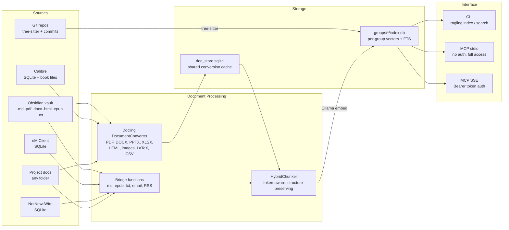

# Ragling Architecture Overview

Ragling is a Docling-powered local RAG (Retrieval Augmented Generation) system with a shared document cache and per-group vector indexes. It indexes personal knowledge from multiple sources, converts documents through a unified Docling pipeline, and exposes hybrid vector + full-text search via CLI and MCP server. Everything runs locally -- no cloud APIs, no API keys, no data leaves the machine.

## Design Principles

- **Everything runs locally.** No cloud APIs, no API keys, no data leaves the machine. Embeddings via Ollama, document conversion via Docling, search via SQLite.
- **Incremental indexing.** Only new or changed files are re-embedded, using SHA-256 hash comparison. Use `--force` to re-index everything.
- **Hybrid search.** Every query runs both semantic (vector) and keyword (full-text) search, merged with Reciprocal Rank Fusion for best results.
- **Collection-based organization.** Sources are grouped into collections (system collections like "obsidian" and "email", code groups, or user-created project collections).
- **Content-addressed document cache.** Docling conversions are cached in a shared SQLite store keyed by SHA-256 file hash + converter config hash. Multiple MCP instances share this cache, so a document is never converted twice.
- **Per-group isolation.** Each MCP instance gets its own embedding index (`groups/{name}/index.db`). Groups share the document cache but not vectors. Deleting a group removes only its embeddings.

## System Architecture



## Document Conversion: Docling

[Docling](https://github.com/DS4SD/docling) is an IBM open-source universal document converter that produces structured `DoclingDocument` objects from a wide range of input formats.

### Formats handled directly by Docling

Docling's `DocumentConverter` handles these formats natively:

- PDF
- DOCX
- PPTX
- XLSX
- HTML
- Images (PNG, JPG, TIFF, BMP, WebP)
- LaTeX
- CSV
- AsciiDoc

### Bridge functions

Formats not handled by Docling's converter are transformed into `DoclingDocument` objects via bridge functions in `docling_bridge.py`:

| Bridge Function | Input | How it works |
|----------------|-------|--------------|
| `markdown_to_docling_doc()` | Markdown text | Parses heading hierarchy, preserves structure as headings + paragraphs |
| `epub_to_docling_doc()` | EPUB chapters | Wraps each chapter as a heading with paragraph content |
| `plaintext_to_docling_doc()` | Plain text | Splits on double newlines into paragraphs |
| `email_to_docling_doc()` | Email subject + body | Subject as document name, body split into paragraphs |
| `rss_to_docling_doc()` | Article title + body | Title as document name, body split into paragraphs |

All bridge functions produce `DoclingDocument` objects, so every format flows through the same `HybridChunker` pipeline.

### PDF enrichments

The PDF pipeline is configured with five enrichments (see `docling_convert.py`):

| Enrichment | Model/Mode | What it does |
|-----------|-----------|-------------|
| Picture descriptions | SmolVLM | Generates text descriptions of images in PDFs |
| Code extraction | codeformulav2 | Extracts code blocks from PDF pages |
| Formula extraction | codeformulav2 | Extracts mathematical formulas as LaTeX |
| Accurate tables | `TableFormerMode.ACCURATE` | High-quality table structure extraction with cell matching |
| Caption preservation | Built-in | Preserves figure and table captions in metadata |

Enrichment metadata (picture descriptions, captions, code language) is extracted from `DoclingDocument` items and carried through to chunk metadata for search filtering.

### Config hash in cache key

The converter pipeline configuration (which enrichments are enabled, table mode) is hashed and included in the doc_store cache key. Changing enrichment settings automatically invalidates cached conversions, triggering re-conversion on the next index.

## Shared Document Cache (doc_store)

The document cache (`doc_store.sqlite`) is a content-addressed store that avoids duplicate Docling conversions across groups and MCP instances.

- **Content-addressed by SHA-256 file hash + converter config hash.** The same file with the same pipeline settings always produces a cache hit.
- **Stores full `DoclingDocument` as JSON.** The complete structured document is serialized, not just extracted text, so downstream chunking can use headings, tables, and enrichment metadata.
- **Shared across all groups.** Multiple MCP instances (each with their own per-group vector index) share a single doc_store. If one group has already converted a PDF, another group reuses the cached conversion.
- **WAL mode for concurrent access.** SQLite Write-Ahead Logging enables multiple simultaneous readers across MCP instances.
- **Default location:** `~/.ragling/doc_store.sqlite`

### Schema

```sql
CREATE TABLE sources (
    id INTEGER PRIMARY KEY AUTOINCREMENT,
    source_path TEXT NOT NULL,
    content_hash TEXT NOT NULL,
    file_size INTEGER,
    file_modified_at TEXT,
    discovered_at TEXT DEFAULT (datetime('now')),
    UNIQUE(source_path)
);

CREATE TABLE converted_documents (
    id INTEGER PRIMARY KEY AUTOINCREMENT,
    source_id INTEGER NOT NULL REFERENCES sources(id) ON DELETE CASCADE,
    content_hash TEXT NOT NULL,
    config_hash TEXT NOT NULL DEFAULT '',
    docling_json TEXT NOT NULL,
    format TEXT NOT NULL,
    page_count INTEGER,
    conversion_time_ms INTEGER,
    converted_at TEXT DEFAULT (datetime('now')),
    UNIQUE(source_id, content_hash, config_hash)
);
```

## Per-Group Vector Indexes

Each group gets its own SQLite database at `groups/{name}/index.db` containing embeddings, FTS indexes, and collection metadata.

- **SQLite + sqlite-vec + FTS5.** Each per-group database has the same schema: `collections`, `sources`, `documents`, `vec_documents`, `documents_fts`, and `meta`.
- **Groups share the doc_store but not embeddings.** Two groups indexing the same PDF reuse the cached Docling conversion but generate and store their own embedding vectors independently.
- **Deleting a group removes only its vectors.** The shared doc_store retains the cached conversion for other groups to use.
- **WAL mode** for concurrent read access during search while indexing is in progress.

### Schema

```sql
CREATE TABLE collections (
    id INTEGER PRIMARY KEY AUTOINCREMENT,
    name TEXT NOT NULL UNIQUE,
    collection_type TEXT NOT NULL DEFAULT 'project',  -- 'system', 'project', or 'code'
    description TEXT,
    created_at TEXT DEFAULT (datetime('now'))
);

CREATE TABLE sources (
    id INTEGER PRIMARY KEY AUTOINCREMENT,
    collection_id INTEGER NOT NULL REFERENCES collections(id) ON DELETE CASCADE,
    source_type TEXT NOT NULL,
    source_path TEXT NOT NULL,
    file_hash TEXT,
    file_modified_at TEXT,
    last_indexed_at TEXT,
    UNIQUE(collection_id, source_path)
);

CREATE TABLE documents (
    id INTEGER PRIMARY KEY AUTOINCREMENT,
    source_id INTEGER NOT NULL REFERENCES sources(id) ON DELETE CASCADE,
    collection_id INTEGER NOT NULL REFERENCES collections(id) ON DELETE CASCADE,
    chunk_index INTEGER NOT NULL,
    title TEXT,
    content TEXT NOT NULL,
    metadata TEXT,  -- JSON
    created_at TEXT DEFAULT (datetime('now')),
    UNIQUE(source_id, chunk_index)
);

-- sqlite-vec virtual table for vector similarity search
CREATE VIRTUAL TABLE vec_documents USING vec0(
    embedding float[1024],
    document_id INTEGER
);

-- FTS5 virtual table for keyword search
CREATE VIRTUAL TABLE documents_fts USING fts5(
    title, content,
    content='documents', content_rowid='id'
);

-- Triggers keep FTS in sync with documents table
-- (AFTER INSERT, AFTER DELETE, AFTER UPDATE)

CREATE TABLE meta (
    key TEXT PRIMARY KEY,
    value TEXT
);
```

Relationships: `collections` 1:N `sources` 1:N `documents`. CASCADE deletes ensure clean removal.

## Chunking: HybridChunker

All formats are chunked through docling-core's `HybridChunker`, providing a unified chunking strategy across every source type.

- **Token-aware splitting.** Chunks are sized by token count (default 256 tokens), aligned to the embedding model's tokenizer (`BAAI/bge-m3`) for optimal embedding quality.
- **Structure-preserving.** The chunker respects document structure: headings, paragraphs, tables, and code blocks are kept intact where possible rather than split mid-element.
- **Heading path as context prefix.** `HybridChunker.contextualize()` prepends the heading hierarchy to each chunk, so a chunk under "Chapter 3 > Installation > Prerequisites" includes that path as context for the embedding.
- **Enrichment metadata carried through.** Picture descriptions, table captions, and code language from Docling enrichments are extracted from chunk `doc_items` and stored in chunk metadata for filtering and display.

## Supported Sources

### System Collections

| Source | Collection | Data Source | What's Indexed |
|--------|-----------|-------------|----------------|
| **Obsidian** | `obsidian` | Vault directory | All supported file types. Markdown files: frontmatter, wikilinks, tags extracted, then bridged to DoclingDocument. PDF/DOCX/HTML: converted via Docling. EPUB/TXT: bridged to DoclingDocument. All chunked by HybridChunker. |
| **eM Client** | `email` | SQLite databases (read-only) | Email subject, body, sender, recipients, date, folder. Body text bridged to DoclingDocument via `email_to_docling_doc()`, chunked by HybridChunker. |
| **Calibre** | `calibre` | SQLite metadata.db + book files (read-only) | EPUB and PDF book content with rich metadata (authors, tags, series, rating, publisher). PDFs converted via Docling; EPUBs bridged to DoclingDocument. Metadata-only entries for books without supported file formats. |
| **NetNewsWire** | `rss` | SQLite databases (read-only) | RSS/Atom article title, author, content, feed name. HTML content stripped, then bridged to DoclingDocument via `rss_to_docling_doc()`, chunked by HybridChunker. |

### User Collections

| Source | Collection | Data Source | What's Indexed |
|--------|-----------|-------------|----------------|
| **Git Repos** | group name | Git-tracked files | Code files parsed with tree-sitter (17 languages) + commit history (messages and per-file diffs). Respects .gitignore. Code parsing is independent of the Docling pipeline. |
| **Project Docs** | user-specified name | Any folder | Files routed to Docling converter or bridge function by extension, then chunked by HybridChunker. |

## Technology Stack

| Component | Choice | Notes |
|-----------|--------|-------|
| Language | Python 3.12+ | |
| Database | SQLite + sqlite-vec + FTS5 | Per-group indexes + shared doc store |
| Embeddings | Ollama + bge-m3 (1024d) | Fully local |
| Document conversion | Docling | PDF, DOCX, PPTX, XLSX, HTML, images, LaTeX, CSV |
| Code parsing | tree-sitter | 17 languages |
| Chunking | HybridChunker (docling-core) | Token-aware, structure-preserving |
| CLI | click | |
| MCP server | FastMCP (mcp Python SDK) | stdio + SSE transport |
| File watching | watchdog | FSEvents on macOS |
| Auth | Bearer token | SSE transport only |

## Hybrid Search with RRF

Every search query runs two parallel searches:

1. **Vector search** -- the query is embedded via Ollama and compared against stored embeddings by cosine distance via sqlite-vec.
2. **Full-text search** -- the query is tokenized and matched against the FTS5 index for keyword matches.

Results are merged using Reciprocal Rank Fusion:

```
score(doc) = vector_weight / (k + vec_rank) + fts_weight / (k + fts_rank)
```

Default parameters: `k=60`, `vector_weight=0.7`, `fts_weight=0.3`.

For a detailed explanation of the algorithm with worked examples, see [Hybrid Search and RRF](hybrid-search-and-rrf.md).

## SSE Transport and Authentication

Ragling supports dual transport for its MCP server:

- **stdio** (default): No authentication. Full access to all collections. Used by Claude Desktop and Claude Code when configured directly.
- **SSE**: Bearer token authentication with per-user scoping. Started with `ragling serve --sse --port 10001`.

### User model

Each user is defined in the config with:

- **`api_key`**: Bearer token for SSE authentication.
- **`system_collections`**: List of system collections (e.g., `["obsidian", "email"]`) the user can search.
- **`path_mappings`**: Host-to-container prefix replacement for environments where the MCP server and client see different filesystem paths.

### Visibility

When authenticated via SSE, a user sees:

- Their own collection (named after their username)
- The `global` collection (if `global_paths` are configured)
- Any system collections listed in their `system_collections` config

Unauthenticated stdio access sees all collections.

### Authentication flow

1. Client sends `Authorization: Bearer <api_key>` header.
2. `RaglingTokenVerifier.verify_token()` resolves the API key against configured users via `resolve_api_key()`.
3. On success, returns an `AccessToken` with `client_id` set to the username.
4. Tool functions call `_get_user_context()` to derive a `UserContext` from the current request's access token.
5. Search results are filtered to `visible_collections` and paths are mapped through the user's `path_mappings`.

## Auto-Detection and Indexing

### Auto-detection

When indexing a directory (during startup sync or via the watcher), ragling detects the content type by marker files:

1. `.obsidian/` directory present --> Obsidian vault indexer (frontmatter, wikilinks, tags)
2. `.git/` directory present --> Git repository indexer (tree-sitter code + commit history)
3. Neither --> Project document indexer (routes files by extension)

Obsidian takes precedence over git (a vault with version control is primarily notes, not code).

### Startup sync

When the MCP server starts:

1. A background daemon thread scans configured directories (`home/{username}/` dirs and `global_paths`).
2. Each directory is routed through auto-detection and indexed with the appropriate indexer.
3. The MCP server is available immediately -- it does not wait for sync to complete.
4. An `IndexingStatus` tracker reports progress in search responses so clients know indexing is ongoing.

### File watcher

After startup sync completes:

1. Watchdog monitors all configured directories (home + global paths) for file creation and modification events.
2. Events are filtered by supported file extension.
3. A `DebouncedIndexQueue` batches rapid changes (2-second debounce window) to avoid redundant re-indexing.
4. Batched changes are re-indexed using the project indexer.

## Data Flow: Indexing

```
File on disk / SQLite database
    |
    v
Format detection (extension-based)
    |
    +-- Docling format -------> DocumentConverter -------> DoclingDocument
    |   (pdf, docx, pptx,                                      |
    |    xlsx, html, images,                                    |
    |    latex, csv, asciidoc)                                  |
    |                                                           |
    +-- Bridge format --------> bridge function ----------> DoclingDocument
    |   (md, epub, txt,                                         |
    |    email body, rss body)                                  |
    |                                                           |
    +-- Code ----------------> tree-sitter parser               |
    |                          (direct to index)                |
    +-- Email ---------------> eM Client SQLite reader          |
    |                          (body -> bridge)                 |
    +-- RSS -----------------> NetNewsWire SQLite reader         |
    |                          (content -> bridge)              |
    +-- Calibre -------------> metadata.db reader               |
    |                          (books -> Docling or bridge)     |
    |                                                           |
    v                                                           v
doc_store cache                                          HybridChunker
(SHA-256 + config hash key,                             (256 tokens, structure-aware)
 skip if cached)                                              |
                                                              v
                                                    Ollama embed (bge-m3, 1024d)
                                                              |
                                                              v
                                                    Per-group index.db insert
```

## Data Flow: Search

```
Query string
    |
    +---> Ollama embed ---> sqlite-vec MATCH (top-k by distance)
    |                              |
    +---> FTS5 MATCH (top-k by rank)
                                   |
                                   v
                          RRF merge + dedup
                                   |
                                   v
                          Apply filters (collection, type, date, sender, author)
                                   |
                                   v
                          visible_collections filtering (SSE users only)
                                   |
                                   v
                          Path mapping (SSE users only)
                                   |
                                   v
                          SearchResult objects (content, title, metadata,
                                               score, collection, source_path, source_uri)
```

## Configuration

Config file: `~/.ragling/config.json`

```json
{
  "db_path": "~/.ragling/rag.db",
  "shared_db_path": "~/.ragling/doc_store.sqlite",
  "group_db_dir": "~/.ragling/groups",
  "group_name": "default",
  "embedding_model": "bge-m3",
  "embedding_dimensions": 1024,
  "chunk_size_tokens": 256,
  "chunk_overlap_tokens": 50,
  "home": "~/ragling-data/home",
  "global_paths": ["~/ragling-data/shared"],
  "obsidian_vaults": ["~/Documents/MyVault"],
  "obsidian_exclude_folders": ["_Inbox", "_Templates"],
  "emclient_db_path": "~/Library/Application Support/eM Client",
  "calibre_libraries": ["~/CalibreLibrary"],
  "netnewswire_db_path": "~/Library/Containers/com.ranchero.NetNewsWire-Evergreen/Data/Library/Application Support/NetNewsWire/Accounts",
  "code_groups": {
    "my-org": ["~/Repository/my-org/repo1", "~/Repository/my-org/repo2"],
    "terraform": ["~/Repository/my-org/tf-infra"]
  },
  "disabled_collections": [],
  "git_history_in_months": 6,
  "git_commit_subject_blacklist": [],
  "search_defaults": {
    "top_k": 10,
    "rrf_k": 60,
    "vector_weight": 0.7,
    "fts_weight": 0.3
  },
  "users": {
    "alice": {
      "api_key": "sk-alice-secret-key",
      "system_collections": ["obsidian", "email", "calibre", "rss"],
      "path_mappings": {
        "~/ragling-data/home/alice/": "/workspace/"
      }
    },
    "bob": {
      "api_key": "sk-bob-secret-key",
      "system_collections": ["obsidian"],
      "path_mappings": {}
    }
  }
}
```

Key settings:

| Setting | Default | Description |
|---------|---------|-------------|
| `db_path` | `~/.ragling/rag.db` | Legacy single-database path (used when `group_name` is `"default"`) |
| `shared_db_path` | `~/.ragling/doc_store.sqlite` | Shared document conversion cache |
| `group_db_dir` | `~/.ragling/groups` | Parent directory for per-group index databases |
| `group_name` | `"default"` | Active group name (set per MCP instance) |
| `home` | `null` | Base directory containing per-user subdirectories for SSE |
| `global_paths` | `[]` | Directories visible to all authenticated users |
| `users` | `{}` | Per-user SSE config: API key, system collections, path mappings |
| `embedding_model` | `"bge-m3"` | Ollama model name |
| `embedding_dimensions` | `1024` | Vector size (must match model) |
| `chunk_size_tokens` | `256` | Maximum tokens per chunk |
| `obsidian_vaults` | `[]` | Obsidian vault paths |
| `code_groups` | `{}` | Map of group name to list of git repo paths |
| `disabled_collections` | `[]` | Collections to skip during indexing |

## Project Structure

```
src/ragling/
  cli.py                   CLI entry point (index, search, serve, mcp-config)
  config.py                Frozen Config dataclass with with_overrides()
  db.py                    Database init, migrations
  embeddings.py            Ollama embedding helpers
  search.py                Hybrid search engine (vector + FTS + RRF, batch lookups)
  search_utils.py          FTS5 query escaping
  chunker.py               Chunk dataclass and utilities
  doc_store.py             Content-addressed document cache
  docling_convert.py       Docling DocumentConverter wrapper + enrichments
  docling_bridge.py        Bridge functions (md/epub/txt/email/rss -> DoclingDocument)
  mcp_server.py            MCP server (stdio + SSE)
  auth.py                  API key resolution and user context
  token_verifier.py        SSE Bearer token validation
  tls.py                   Self-signed CA and server cert for SSE
  sync.py                  Startup sync engine with per-collection status
  watcher.py               File watcher (watchdog, debounced)
  config_watcher.py        Atomic config reload on file change
  system_watcher.py        Monitors external DB files (eM Client, Calibre, NNW)
  indexing_queue.py        Single queue, single worker thread for indexing
  indexing_status.py       Per-collection indexing progress tracker
  path_mapping.py          Host/container path translation
  parsers/
    markdown.py            Obsidian .md parser
    email.py               eM Client SQLite reader
    calibre.py             Calibre metadata.db parser
    rss.py                 NetNewsWire RSS parser
    code.py                Tree-sitter code parser
    epub.py                EPUB text extraction (bridge input)
  indexers/
    base.py                Abstract base indexer
    obsidian.py            Obsidian vault indexer
    email_indexer.py       eM Client email indexer
    calibre_indexer.py     Calibre ebook indexer
    rss_indexer.py         NetNewsWire RSS indexer
    git_indexer.py         Git repository indexer
    project.py             Project document indexer
    auto_indexer.py        Auto-detection routing
    discovery.py           Path discovery and marker detection
```
