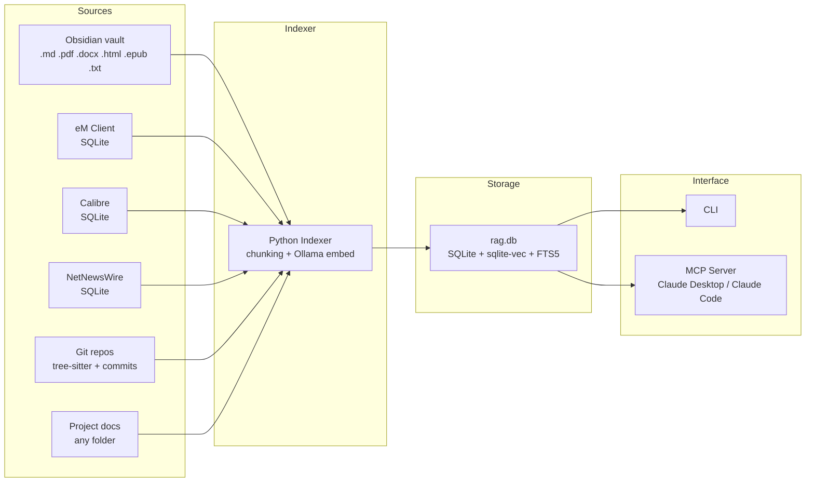

# local-rag Architecture Overview

A fully local, privacy-preserving RAG (Retrieval Augmented Generation) system for macOS. Indexes personal knowledge from multiple sources into a single SQLite database with hybrid vector + full-text search. Exposes search via CLI and an MCP server so Claude Desktop and Claude Code can query it directly.

## Design Principles

- **Everything runs locally.** No cloud APIs, no API keys, no data leaves the machine.
- **Incremental indexing.** Only new or changed files are re-embedded, using SHA256 hash comparison.
- **Hybrid search.** Every query runs both semantic (vector) and keyword (full-text) search, merged with Reciprocal Rank Fusion for best results.
- **Collection-based organization.** Sources are grouped into collections (system collections like "obsidian" and "email", or user-created project collections).

## System Architecture



## Supported Sources

### System Collections

These are built-in collection types with dedicated parsers and indexers:

| Source          | Collection | Data Source                                 | What's Indexed                                                                                                                              |
|-----------------|------------|---------------------------------------------|---------------------------------------------------------------------------------------------------------------------------------------------|
| **Obsidian**    | `obsidian` | Vault directory                             | All supported file types in the vault (.md, .pdf, .docx, .html, .txt, .epub). Markdown files get frontmatter, wikilink, and tag extraction. |
| **eM Client**   | `email`    | SQLite databases (read-only)                | Email subject, body, sender, recipients, date, folder. Body text from FTI index with preview fallback.                                      |
| **Calibre**     | `calibre`  | SQLite metadata.db + book files (read-only) | EPUB and PDF book content with rich metadata (authors, tags, series, rating, publisher).                                                    |
| **NetNewsWire** | `rss`      | SQLite databases (read-only)                | RSS/Atom article title, author, content, feed name. HTML content converted to plain text.                                                   |

### User Collections

| Source           | Collection          | Data Source       | What's Indexed                                                                   |
|------------------|---------------------|-------------------|----------------------------------------------------------------------------------|
| **Git Repos**    | repo directory name | Git-tracked files | Code files parsed with tree-sitter + commit history (messages and per-file diffs). Respects .gitignore. |
| **Project Docs** | user-specified name | Any folder        | Files dispatched to the correct parser by extension.                             |

## Technology Stack

### SQLite + sqlite-vec + FTS5

The entire database is a single SQLite file (`~/.local-rag/rag.db`). This avoids running any database server.

- **sqlite-vec** adds vector similarity search via a virtual table (`vec_documents`). Embeddings are stored as packed float32 blobs and queried with `WHERE embedding MATCH ?` for nearest-neighbor search.
- **FTS5** (Full-Text Search 5) is SQLite's built-in full-text search engine. A virtual table (`documents_fts`) mirrors the documents table and supports keyword search with `MATCH`.
- **Triggers** keep the FTS index in sync with the documents table automatically on insert, update, and delete.
- **WAL mode** (Write-Ahead Logging) is enabled for better concurrent read/write performance during indexing.

### Ollama + bge-m3

Embeddings are generated locally using Ollama, which runs ML models on-device.

- **bge-m3** is the default embedding model, producing 1024-dimensional vectors. It supports multilingual text and has strong retrieval performance.
- The embedding dimension is configurable — changing the model requires re-indexing all content.
- The Python `ollama` client communicates with the Ollama HTTP API at `localhost:11434`.
- Texts are sent in batches of 32 with a 5-minute timeout per batch to avoid hangs.

### Hybrid Search with Reciprocal Rank Fusion (RRF)

Every search query runs two parallel searches:

1. **Vector search** — the query is embedded and compared against stored embeddings by cosine distance via sqlite-vec.
2. **Full-text search** — the query is tokenized and matched against the FTS5 index for exact keyword matches.

Results from both lists are merged using RRF:

```shell
score(doc) = vector_weight / (k + vec_rank) + fts_weight / (k + fts_rank)
```

Default parameters: `k=60`, `vector_weight=0.7`, `fts_weight=0.3`. This ensures that documents matching semantically AND by keyword rank highest, while either match alone still surfaces results.

### MCP Server (Model Context Protocol)

The MCP server exposes the RAG as tools that Claude Desktop and Claude Code can call directly:

- **`rag_search`** — hybrid search with optional filters (collection, source type, date range, author)
- **`rag_list_collections`** — list all collections with source/chunk counts
- **`rag_collection_info`** — detailed info about a specific collection
- **`rag_index`** — trigger indexing for a collection

Uses the `mcp` Python SDK (FastMCP) with stdio transport by default. Configured via `.mcp.json` in the project root.

## Data Flow: Indexing

```shell
File on disk / SQLite database
    |
    v
Parser (type-specific)
    |  Markdown: extract frontmatter, wikilinks, tags, strip dataview
    |  PDF: extract text page-by-page (pymupdf)
    |  DOCX: extract paragraphs, headings, tables (python-docx)
    |  EPUB: extract chapters (zipfile + BeautifulSoup)
    |  HTML: extract text preserving structure (BeautifulSoup)
    |  Code: tree-sitter structural parsing (functions, classes, etc.)
    |  Commits: git log + git show per-file diffs
    |  Email: eM Client SQLite FTI + preview fallback
    |  Calibre: metadata.db + book file parsing
    |  RSS: NetNewsWire SQLite article content
    | Plaintext: read as-is |
    |-----------------------|
    v
Chunker
    |  Markdown: split on headings, preserve heading path as context prefix
    |  Email: single chunk if short, paragraph-split if long
    |  Code: split on structural boundaries (functions, classes)
    | Plain: fixed-size word windows (~500 words, 50 word overlap) |
    |--------------------------------------------------------------|
    v
Ollama embed (bge-m3, 1024d) --- batches of 32
    |
    v
SQLite insert (within transaction)
    |  sources table: file path, SHA256 hash, mtime
    |  documents table: chunk text, title, metadata JSON
    |  vec_documents: embedding vector
    |  documents_fts: auto-populated via trigger
```

## Data Flow: Search

```shell
Query string
    |
    +---> Ollama embed ---> sqlite-vec MATCH (top-k by distance)
    |                              |
    +---> FTS5 MATCH (top-k by rank)
                                   |
                                   v
                          RRF merge + dedup
                                   |
                                   v
                          Apply filters (collection, type, date, sender, author)
                                   |
                                   v
                          SearchResult objects (content, title, metadata,
                                               score, collection, source_path)
```

## Database Schema

Five tables plus two virtual tables:

| Table           | Purpose                                                                               |
|-----------------|---------------------------------------------------------------------------------------|
| `collections`   | Namespaces for organizing content (system or project)                                 |
| `sources`       | Individual files/emails that have been indexed, with SHA256 hash for change detection |
| `documents`     | Chunked text content with metadata JSON                                               |
| `vec_documents` | sqlite-vec virtual table storing embedding vectors                                    |
| `documents_fts` | FTS5 virtual table mirroring documents for keyword search                             |
| `meta`          | Schema version tracking for migrations                                                |

Relationships: `collections` 1:N `sources` 1:N `documents`. CASCADE deletes ensure clean removal.

## Supported File Types

| Extension                                                             | Parser                                           | Chunking Strategy                 |
|-----------------------------------------------------------------------|--------------------------------------------------|-----------------------------------|
| `.md`                                                                 | Obsidian markdown (frontmatter, wikilinks, tags) | Heading-aware splitting           |
| `.pdf`                                                                | pymupdf page-by-page extraction                  | Per-page plain chunking           |
| `.docx`                                                               | python-docx (paragraphs, headings, tables)       | Plain chunking                    |
| `.epub`                                                               | zipfile + BeautifulSoup chapter extraction       | Per-chapter plain chunking        |
| `.html` / `.htm`                                                      | BeautifulSoup text extraction                    | Plain chunking                    |
| `.txt` / `.csv` / `.json` / `.yaml` / `.yml`                          | Read as plaintext                                | Plain chunking                    |
| `.py` / `.go` / `.tf` / `.ts` / `.js` / `.rs` / `.java` / `.c` / `.h` | tree-sitter structural parsing                   | Function/class boundary splitting |

## CLI Commands

```shell
local-rag index obsidian [--vault PATH]    Index Obsidian vault(s)
local-rag index email                      Index eM Client emails
local-rag index calibre [--library PATH]   Index Calibre ebook libraries
local-rag index rss                        Index NetNewsWire RSS articles
local-rag index group [NAME] [--history]   Index code group(s), optionally with commit history
local-rag index project NAME PATH...       Index docs into a project collection
local-rag index all                        Index all configured sources (includes commit history)
local-rag search QUERY [--collection]      Hybrid search with filters
local-rag collections list                 List all collections
local-rag collections info NAME            Detailed collection info
local-rag collections delete NAME          Delete a collection
local-rag status                           Show database stats
local-rag serve [--port PORT]              Start MCP server
```

All index commands support `--force` to bypass incremental change detection and re-index everything.

## Configuration

Config file: `~/.local-rag/config.json`

Key settings:

- `db_path` — database location (default: `~/.local-rag/rag.db`)
- `embedding_model` — Ollama model name (default: `bge-m3`)
- `embedding_dimensions` — vector size (default: `1024`)
- `chunk_size_tokens` / `chunk_overlap_tokens` — chunking parameters (default: `500`/`50`)
- `obsidian_vaults` — list of vault paths to index
- `obsidian_exclude_folders` — folder names to skip in vaults (e.g. `_Inbox`, `_Templates`)
- `emclient_db_path` — path to eM Client data directory
- `calibre_libraries` — list of Calibre library paths
- `netnewswire_db_path` — path to NetNewsWire accounts directory
- `code_groups` — dict mapping group names to lists of git repo paths
- `git_history_in_months` — months of commit history to index (default: `6`)
- `disabled_collections` — list of collection names to skip during indexing (any collection name)
- `search_defaults` — RRF parameters (`top_k`, `rrf_k`, `vector_weight`, `fts_weight`)

## Project Structure

```shell
src/local_rag/
  config.py              Configuration loading
  db.py                  Database init, migrations, helpers
  embeddings.py          Ollama embedding with batching and timeouts
  chunker.py             Text chunking strategies
  search.py              Hybrid search engine with RRF
  cli.py                 Click CLI entry point
  mcp_server.py          MCP server for Claude integration
  parsers/
    markdown.py          Obsidian markdown parser
    email.py             eM Client email parser
    pdf.py               PDF text extraction
    docx.py              DOCX text extraction
    epub.py              EPUB text extraction
    html.py              HTML text extraction
    plaintext.py         Plaintext reader
    calibre.py           Calibre metadata.db parser
    rss.py               NetNewsWire RSS parser
    code.py              Tree-sitter code parser
  indexers/
    base.py              Abstract base indexer
    obsidian.py          Obsidian vault indexer (all file types)
    email_indexer.py     eM Client email indexer
    calibre_indexer.py   Calibre ebook indexer
    rss_indexer.py       NetNewsWire RSS indexer
    git_indexer.py       Git repository indexer
    project.py           Project document indexer
```
